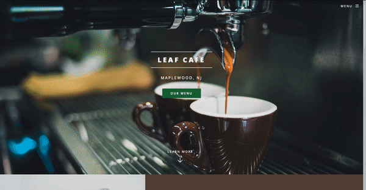

# Leaf Cafe

The is a website for a cafe. Users can see the menu and learn about the cafe's story.

<strong>Link to Project:</strong> https://leafcafe.netlify.app/

# How It's Made:
<strong>Tech used:</strong> HTML, CSS, JavaScript

# Optimizations

In the future, I would like to an order feature. Customers can order ahead on the website and pick up thier order at the cafe.

# Lessons Learned:

The hardest part of this project, was making th gallery on the home page. Some of the images didn't fit the way I wanted them to. It a lot of trail an error for me to get it right in the end. 
